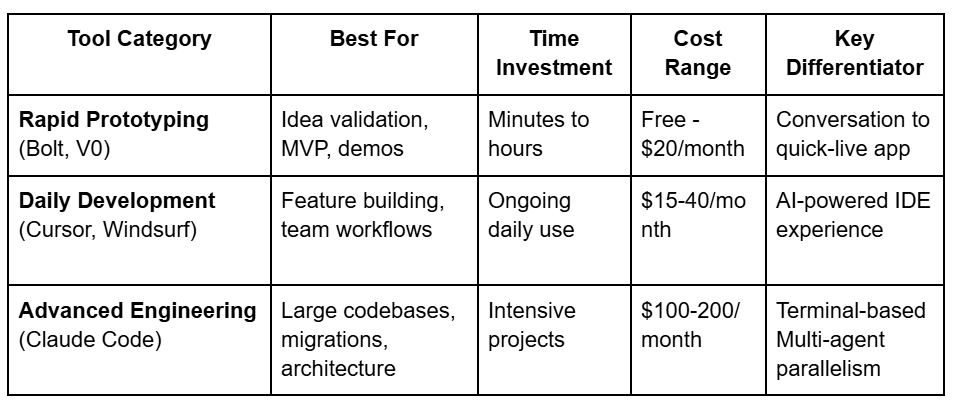
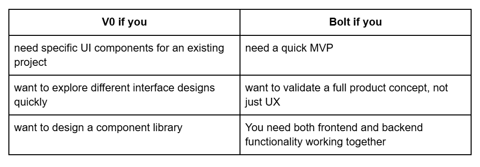
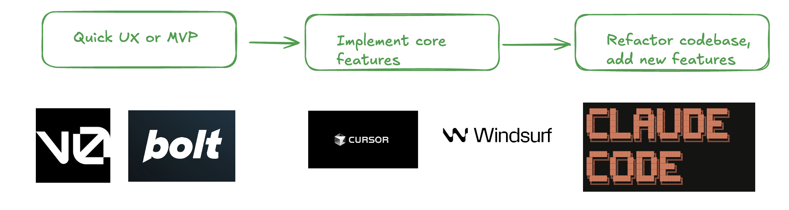
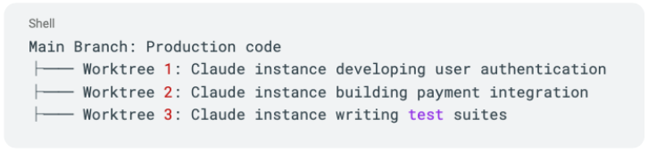
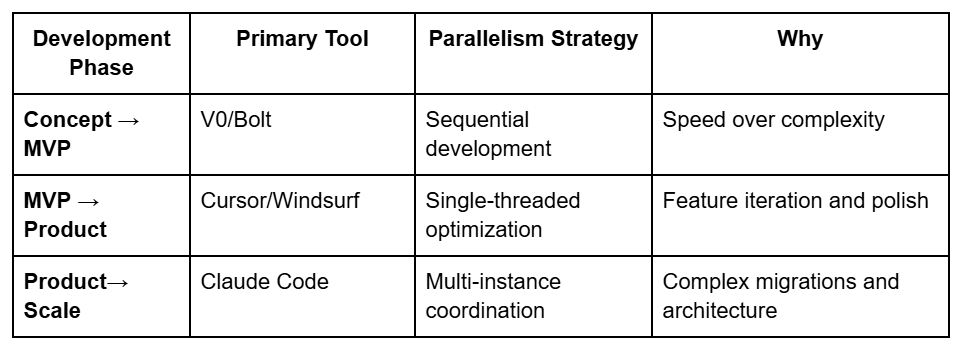

import { YouTube } from '@astro-community/astro-embed-youtube'
import { Tweet } from '@astro-community/astro-embed-twitter';

As a startup founder, your biggest constraint isn't ideas, it's execution speed. Recently, the term "vibe coding" has been trending for the practice of building software through conversations with AI. But with Claude Code, Cursor, Windsurf, and dozens of other tools flooding the market, which ones do you actually need during your startup development journey?

In this article, I will analyze three distinct tiers of AI coding tools and explain which ones to use at different stages of your growth cycle. Each one differs in terms of functionality, features, expectations and pricing.

**TLDR;** Most developers use Tier 1 for UX & rapid prototyping, Tier 2 for daily development, and Tier 3 for complex engineering challenges. **The best strategy is to combine them when needed rather than trying to force one tool to do everything**. Here's what each tier actually delivers and when you should use them

### Tier 1: Bolt, V0
Let's dive into each tier, starting with the fastest way to get from idea to working demo. **If you need to validate an idea quickly, create a compelling demo, or build an MVP quickly, this tier is your starting point**. Both Bolt and V0 excel at transforming conversations into live applications with minimal technical overhead, but they operate at different scales of ambition.

They both deliver some main common functionalities: including a) Web-based, no installation required, b) describe what you want & watch it unfold instantly, and c) one click deployment to share with others.

The difference between them though, is that **V0 focuses on individual React components with Tailwind CSS, which is perfect for UI/UX exploration** and building specific interface elements, while **Bolt goes full-stack, i.e., creates entire applications with frontend, backend logic, and database integration**, to choose from between them:

### The Downsides:
Both tools excel at quick frontend MVPs but **struggle with any serious business logic**. I personally struggled with them beyond building a simple UI, including any sound logic was a great burden that didn’t eventually work out.

The recommended workflow would be to use these tools for rapid prototyping and initial validation, then move to Cursor/Windsurf for refinement of feature building, or bring in Claude Code for more complex engineering.

To conclude this part, V0 and Bolt are good for concept validation, demos, UI exploration, and getting from an idea to a working prototype as fast as possible.

### Tier 2: Cursor, Windsurf
When you're past the prototype phase and need to build real features, maintain code quality while moving fast, the AI-powered IDEs like Cursor and Windsurf become your primary tools. They integrate seamlessly into existing development workflows while providing powerful AI assistance for day-to-day coding tasks.
Both Cursor and Windsurf are essentially VS Code rebuilt around AI, offering similar core capabilities with slightly different approaches to user-control vs automation:
- **AI chat**: Sidebar conversations about your code
- **Business Logic**: works well with small to mid sized code projects
- **Context**: Automatically understand your project structure
- **Diff-based editing**: See changes before applying them

### Affordable: $15-20/month with wide usage limits
The key difference between them is that Cursor gives you **more manual control**; you select files, review every change, maintain tight oversight. While Windsurf is **more automated**, i.e., its Cascade agent figures out context and makes changes with minimal guidance

Most startups I know use the IDEs in this tier. And this is mostly because they aid developers with the main functionalities they need for daily feature development and code reviews. It also helps them maintain code quality while moving fast. And most importantly, boosts their Iterative development which is perfect for startup pivots.
Both tools excel at the same core mission: making AI assistance a natural part of your daily development workflow without the complexity or cost of more advanced solutions.

### The Downsides:

* Both Cursor and Windsurf work well to a certain project size. Once the size grows a certain threshold, it becomes hard for them to maintain the context of the entire codebase.

* Personally I have suffered from AI hallucinations with cursor when the project gets bigger. Moreover,  I consistently hear this complaint from fellow founders.

* Both IDEs fundamentally operate as single-threaded experiences (even with their agent mode). While you can open multiple conversation chats, there's no built-in coordination between them. Each conversation thread handles one task at a time, requiring manual context switching for complex, multi-component work.

### Tier 3: Claude Code
This one is my favourite. For startups facing large codebases, large-scale migrations, or situations where you need multiple AI agents working in parallel across different components of your system, Claude Code currently represents the best solution for AI-assisted development. This isn't just a coding assistant, it's like having an AI software engineer that can coordinate multiple complex tasks simultaneously.

Unlike tools that suggest code snippets, Claude Code operates autonomously: scans entire codebases, edits files, runs tests, notices compilation errors, and iteratively fixes them until everything works.

What makes Claude code unique is its massive scale capabilities including: 
* a) **large context windows** that can understand entire codebases (up to 100k tokens a time), 
* b) **true autonomy** that can work unattended for minutes while you focus on other parts, and most importantly it is 
* c) **terminal-based**, which allows it to work with any IDE, not locked to a specific editor

### Parallelism 
What makes Claude Code truly different is its Parallelism features. That is, Claude Code's most valuable feature is its ability to **work in parallel across multiple contexts simultaneously**. Unlike other tools that handle one conversation thread, Claude Code enables true multi-agent workflows. There are two main manifestations of this parallelism that I would like to talk about.

#### 1. Git Worktrees:
One of the most compelling forms of parallelism in claude code is the Git worktrees. This feature enables developers to work simultaneously and with independent contexts on different git worktrees, then the developer can merge the branches at the end as he likes.

For example a developer implementing a shopping website can spin up three Claude instances with different git branches; where one writes the user authentication endpoint, another one designs and implements the payment integration part, and a third one that is responsible for testing. 

Note that the developer is still responsible for the merge conflicts, but still, these independent tasks and contexts running, will most probably minimize conflicts. i.e., They don’t share the context, and they are running on independent tasks.

#### 2. Intelligent (Sub)Task Orchestration:
When you give Claude Code a complex request, it doesn't just start coding, it plans first then runs independent subtasks in parallel, i.e., similar to how o3 operates with deep research. It does the following steps:

* **Task Decomposition**, which breaks the request into smaller well contained subtasks, i.e., for example, database schema design, API endpoints, frontend components, tests. Notice that each subtask runs independently and in parallel.

* **Model Orchestration**, where it chooses the suitable model for each subtask. For example, it can use Claude Haiku for file summarization, Claude Sonnet for complex logic

* **Execution Coordination**, where it automatically manages the dependencies between the subtasks

* **Quality Assurance**, which runs tests and fixes any issues until everything passes

This functionality of **parallel subtasking** is really cool. I have seen developers use it to simultaneously generate several UI templates for their projects, before deciding on one to proceed further with its business logic.

> **changes tend to be incremental and dependent on the previous design.**

This is a hurdle with other tools like cursor, bolt or v0, which will start with a draft UI, and if you don’t like it, you can iteratively & sequentially prompt it to change or start from scratch. And this is usually not that much of a successful approach, because the changes tend to be incremental and dependent on the previous design.

To sum up, use Claude Code for :
* **major projects**
* **architectural changes**
* **legacy code migrations**
* **when you need to implement complex features across dozens of files**

On the other hand, it's an overkill for daily bug fixes but invaluable for the heavy lifting that typically requires senior developers.

### The Downsides:  
Claude Code’s power comes at a cost. Heavy parallel usage can burn a ton of tokens (I personally use Claude Code Max to overcome hefty expenses), and coordinating multiple agents requires more sophisticated project management, and this one is minor, but the terminal-based interface feels retro compared to modern IDEs, nonetheless, the raw capability is unmatched.

### Conclusion
So what's the bottom line? There are many tools out there for “vibe coding”, and each one excels in particular functionalities and features. Don’t try to force one tool to do everything. Rather, you can use different tools for different phases of your development cycle, with Claude Code's parallelism reserved for their most challenging tasks.

A recommended workflow would look like this: use V0/Bolt for the initial stages to create a quick UX or MVP, then Cursor/Windsurf to implement core features, then Claude Code with parallel git worktrees to refactor the entire codebase, add new features, or testing capabilities.

I personally use Cursor for daily development with Claude Code (as a plugin) for complex tasks. This gives me the best of both worlds: familiar IDE experience with access to advanced parallelism when needed. What is your preferred workflow?
If you are working on an interesting project or idea, give it a try and apply to @alliancedao here. We would love to hear about it.

<Tweet id="https://x.com/Drmelseidy/status/1943322572046684669" />