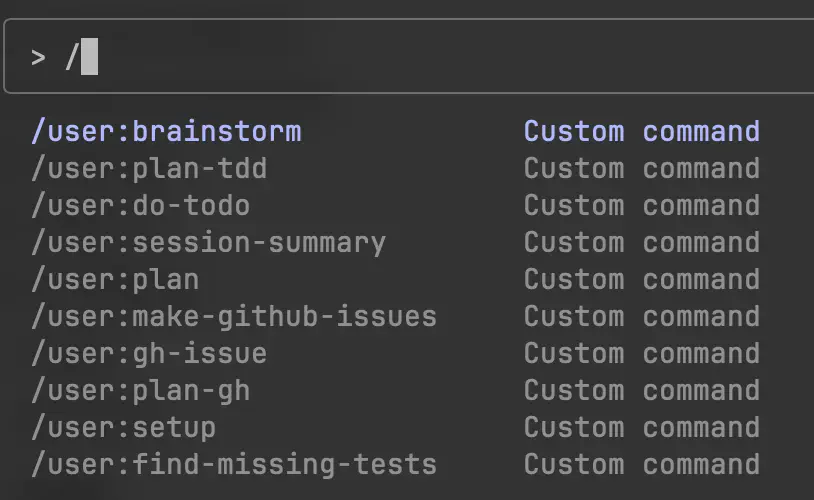

import { YouTube } from '@astro-community/astro-embed-youtube'
import { Tweet } from '@astro-community/astro-embed-twitter';

My workflow is very similar to what it was before.

* I chat with gpt-4o to hone my idea
* I use the best reasoning model I can find to generate the spec. These days it is o1-pro or o3 (is o1-pro better than o3? Or do I feel like it is better cuz it takes longer?)
* I use the reasoning model to generate the prompts. Using an LLM to generate prompts is a beautiful hack. It makes boomers mad too.
* I save the spec.md, and the prompt_plan.md in the root of the project.
*I then type into claude code the following:

```
1. Open **@prompt_plan.md** and identify any prompts not marked as completed.
2. For each incomplete prompt:
    - Double-check if it's truly unfinished (if uncertain, ask for clarification).
    - If you confirm it's already done, skip it.
    - Otherwise, implement it as described.
    - Make sure the tests pass, and the program builds/runs
    - Commit the changes to your repository with a clear commit message.
    - Update **@prompt_plan.md** to mark this prompt as completed.
3. After you finish each prompt, pause and wait for user review or feedback.
4. Repeat with the next unfinished prompt as directed by the user.
```

* The magic with this prompt is that it checks the prompt plan. Looks for things that are not marked as completed, then does the next remaining task. It commits it to git, and then updates the prompt plan with what is complete. It then pops up and asks you to continue once it is done. 🤌

* I then kick back and tell claude yes while it does the work. It will pop up for feedback, and magic happens.

* Lots more cookie clicker.

This works super well. There are a few superpowers you can embed in your process that will really help.

#### Defensive coding!

##### Testing

Testing and test-driven development is a must. I highly recommend really engaging in building out a robust TDD practice.

I was a TDD hater. I was bad at it and I felt like I was wasting time. I was not correct. Lol. I recognize that, and we built in a lot of testing into our companies and projects over the past few decades. Most of the testing was added AFTER the core work was done. This is fine for humans.

THIS IS BAD FOR ROBOTS.

The robots LOVE TDD. Seriously. They eat it up.

With TDD you have the robot friend build out the test, and the mock. Then your next prompt you build the mock to be real. And the robot just loves this. It is the most effective counter to hallucination and LLM scope drift I have found. It really helps the robots to stay on task.

##### Linting

I am such a fan of linting. It is so nice. Ruff is a wonderful product. Biome is cool. Clippy is fun (and a good name).

For whatever reason the ROBOTS love to run a good linter.

Building in the practice to run the linter constantly has kept a lot of bugs away, and kept the code more maintainable and easier to read. You know this already.

Add in a good formatter and everything is beautiful.

##### Pre Commit hooks

**The real magic of all this is to add these tasks to a pre-commit hook**. I recommend the pre-commit python package. You can easily use it via an `uv tools install pre-commit command` and then just build out a nice `.pre-commit-config.yaml` file and bam. Every time you try and commit it will run all these wonderful tests, type checking, linting, and whatnot to make sure your code is A+++ would execute again.

This is a great hack for working with Claude Code. The robot REALLLLLY wants to commit. So when you instruct it to do some code and then commit (like I did above) it will make wild code changes, commit the code, inevitably fuck it all up and then have to fix it.

This is nice cuz it doesn’t clog your GitHub actions with a bunch of linting, formatting, and type checking execution that doesn’t pass cuz the robot was in a mood.

> A funny thing about claude is it CANNOT for the life of it figure out how to use `uv` correctly. It will pip install shit all over the place if you are not careful. And if you instruct it to use `uv` it will just use `uv pip install`. Maybe AGI isn’t going to happen in June. so sad.

### Claude.md and commands
These are both really simple additions that can squeeze a lot out.

I stole a CLAUDE.md from my friend Jesse Vincent who did an awful lot of work on making it very robust. It is quite nice. Some things that are built into it:

* a light version of the big daddy rule.
* instructions on how to do TDD
* stylistic instructions on how I like to code

> @clint configured his CLAUDE.md to call him MR BEEF and it is currently embedding info about MR BEEF in our all documentation: “If you’re stuck, stop and ask for help—MR BEEF may know best.”. While typing this out, I decided to make my CLAUDE.md file call me “Harp Dog.” This is a feature, not a bug.


The commands are also really nice. You can see some of mine in my dotfiles here.



I used to use the commands way more, but it is a really great way to get a lot out of regularly used prompts. You can also pass arguments to the commands. For instance in my github issues command, you pass the issue number that you want claude to look at: `/user:gh-issue #45`

Claude will now go and run through the `prompt` script that is defined in the `gh-issue.md` file.

You can also put these commands in a project directory, and make a custom CLAUDE.md in the project directory. I do this to make hugo, rust, go, or javascript specific commands per project.

### “Continue”
Sometimes I feel like that bird that Homer got to hit “y”. I am just writing “continue” or pressing up and pasting in the same prompt.

Most of the time the plans are about 8–12 steps. I can usually get through a Greenfield development plan in about 30–45 minutes regardless of apparent complexity or language.

I was talking through with my friend Bob and he did not believe it. I asked him “name a thing to build, a language to build it in - and let’s see!”

He was like “ok. A basic interpreter in C.”

This wasn’t ideal. I don’t know C. I don’t really know how to write an interpreter, nor do I really want to. But fuck it.

I followed the above steps and Claude Code did great. We have a working basic interpreter. The first version worked within an hour. I futzed with it for a few more hours and it is pretty good. Would it ship it in 1982? Probably not. You can see the prompt plan here.

### The Team
Our entire team is using Claude Code currently. We are all approximately following the above process with a lot of person tweaks.

We are doing way way higher test coverage than we have ever done. We have better code, and it seems to be just as effective as the horrible code we wrote in the past. It is fun to glance at people working and see claude code running in ghostty, in vscode terminal, in zed terminal, and messing with python notebooks.


### Reference
[Basic Claude Code](https://harper.blog/2025/05/08/basic-claude-code/)


