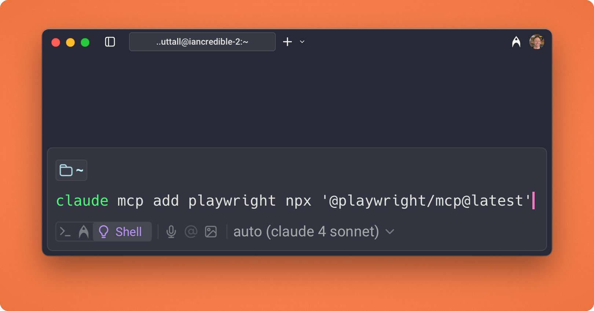

import { YouTube } from '@astro-community/astro-embed-youtube'
import { Tweet } from '@astro-community/astro-embed-twitter';

### 1. Take longer than you think to plan.

I like to use Claude Desktop in an open-ended conversation about the project. Discuss:

- Tech stack
- Packages and libraries to use
- MVP features needed

Do some manual research to verify suggestions, especially if it's a new stack to you

### 2. Find URLs and repos to share

A lot of times Claude won't know the latest packages, so I always find URLs to docs and GitHub repos that I can give as context on HOW it should be implemented

Pro tip: use uithub.⁠com instead of github.⁠com to get LLM friendly repo context

### 3. Ask Claude to write a highly detailed, step-by-step plan

I ask Claude to write a very meticulous and detailed plan that anybody (human or agent) can follow.

**IMPORTANT**: I do NOT give Claude Code the entire plan. It's for me to work through as the conductor one step at a time

### 4. Get a working version ASAP

Instead of trying to "one shot" an entire app with all features, the focus for you (and Claude) should be to get a bare minimum MVP version working - fast!

Get it working, then iterate and improve. **It's easier to add one feature than 10 features**

### 5. Run /init in Claude Code to create a CLAUDE.⁠md file

Do this once you have a working MVP and then use # to add new memories to it later:

**Always run bun typecheck to check for type errors**

This root `CLAUDE.⁠md` should be for general, project level rules **ONLY**

### 6. Add CLAUDE.⁠md files to subdirectories

This is the unsung hero of making Claude Code less "dumb". Instead of one giant rule file, each dir can have their own:

`/src/components/CLAUDE.⁠md`    
`/src/db/CLAUDE.⁠md`

This gives Claude more precise context and makes a HUGE difference

### 7. Track every session

- What are you working on?
- What did you do in the session?
- What worked? What didn't?
- What are the next steps?

I use my Claude Sessions commands for this so I have memory of everything I built (and can use for future context)

[Claude Session](https://github.com/iannuttall/claude-sessions)

### 8. Use /clear as early as possible

You can also use /compact but if you log sessions you can use the last session as detailed context instead.

Claude gets less effective when you see the context warning. I try to end session and clear as soon as I get to a good stopping point.

### 9. Use subagents and "ultrathink" sparingly

Both are very powerful, but both burn through your context and this is what makes Claude feel "dumber".

I like to use subagents and ultrathink to have Claude understand and plan, then I save the session and /clear to begin working.

### 10. Use Repo Prompt for tough bugs/features

o3 is a very good coding model for tough problems but it's not a great agent. Repo Prompt MCP lets Claude find context, give it to o3 and have o3 implement it.

Even with heavy use this is often ~$5-10/day max!

<YouTube id="https://youtu.be/TtRtkTzHVBU" />

### 11. Use the Playwright MCP to test your app

Playwright can view, click, navigate, view the console, take screenshots and fully test your app, feeding it back to Claude to fix things.

Pro tip: add instructions to CLAUDE.⁠md on how to use it!

### 12. GO SLOWER!

It can be tempting to spin up 6 agents in git worktrees, each of those deploying 20+ specialized subagents but you lose understanding of your context

It's fun & can be useful for learning, but for deep work, going slower and knowing your codebase is 100x better!

#### Reference 

<Tweet id="https://twitter.com/iannuttall/status/1951243907628724725" />
